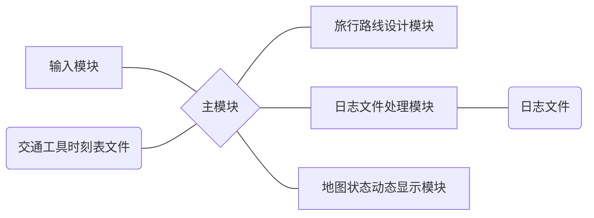

# 设计任务的描述

城市之间有各种交通工具（汽车、火车和飞机）相连，有些城市之间无法直达，需要途径中转城市。某旅客于某一时刻向系统提出旅行要求。考虑在当前COVID-19疫情环境下，各个城市的风险程度不一样，分为低风险、中风险和高风险三种。系统根据风险评估，为该旅客设计一条符合旅行策略的旅行线路并输出；系统能查询当前时刻旅客所处的地点和状态（停留城市/所在交通工具）

# 功能需求说明及其分析

* 城市总数不少于10个，为不同城市设置不同的单位时间风险值：低风险城市为0.2；中风险城市为0.5；高风险城市为0.9。各种不同的风险城市分布要比较均匀，个数均不得小于3个。旅客在某城市停留风险计算公式为：旅客在某城市停留的风险=该城市单位时间风险值*停留时间

* 为不同交通工具设置不同单位时间风险值

  * 交通工具单位之间风险值分别：汽车 = 2；火车 = 5 飞机 = 9
  * 旅客乘坐某班次交通工具的风险 = 该交通工具单位时间风险值*该班次起点城市的单位风险值*乘坐时间
  * 将乘坐交通工具的风险考虑进来，从而实现两种风控策略

* 建立汽车、火车和飞机的时刻表（航班表），假设各种交通工具均为起点到终点的直达，中途无经停
  - 不能太简单，城市之间不能总只是1班车次；
  - 整个系统中航班数不得超过10个，火车不得超过30列次；汽车班次无限制；
  
* 旅客的要求包括：姓名、起点、终点、选择的低风险旅行策略和是否考虑交通工具的风险。其中，低风险旅行策略包括：

  * 最少风险策略：无时间限制，风险最少即可
  * 限时最少风险策略：在规定的时间内风险最少，需要输入限制时间

* 旅行模拟系统以时间为轴向前推移，每1秒左右向前推进1个小时(非查询状态的请求不计时，即：有鼠标和键盘输入时系统不计时)；

* 不考虑城市内换乘交通工具所需时间

* 系统时间精确到小时

* 建立日志文件，对旅客状态变化和键入等信息进行记录

* 用图形绘制地图，并在地图上实时反映出旅客的旅行过程

  

# 总体方案设计说明

## 软件开发环境

windows 10开发系统下的 Qt5集成开发环境(Designer 5.12.9 (MinGW 7.3.0 64-bit))

## 总体结构

程序由地图状态动态显示模块，主模块，输入模块，旅行线路设计模块，日志文件处理模块的程序部分和地图及交通工具时刻表文件，日志文件的数据文件部分组成



## 模块划分

* <u>主模块</u>

  >分析从输入模块接受的命令并调用相应的模块，并以时间为轴向前推

* <u>初始化模块</u>

  > 初始化构建运行程序的所需数据

* 窗口模块

  * <u>主窗口模块</u>

    * 地图状态动态显示模块

      > 图形化动态显示地图与旅客行程

    * 计时器模块

      > 计时器控制与显示

    * 日志记录文本框模块

      > 根据写入日志文件的内容，滚动同步显示日志记录

    * 客户数据添加模块

      > 根据输入创建用户旅程计划

  * <u>对话框窗口模块</u>

    * 输入模块

      > 读取用户的输入数据，并传递给主窗口

* <u>旅行线路设计模块</u>

  > 根据算法和输入参数生成相应的旅行路线

* <u>日志文件处理模块</u>

  > 完成相应的日志文件写入和查询结果输出等功能

# 数据结构说明及数据字典

## 数据结构说明

### initdata.qrc

* 交通工具的时刻表（init_lines_map）

  > 属性：txt文件 
  >
  > 权限：资源文件，可读，不可写

  >一个班次的信息属性：起点城市id，终点城市id，班次种类，时间花费，出发时间，班次间隔（时间有关属性的单位均为小时）。
  >
  >时刻表输入文件格式：每行为一个航班信息，属性编写方式如下
  >
  >> start_cid  end_cid  transport_kind  start_hour  timecost  timefre_hour  

### init_data.h

* 地图位置类（map_detail）

  >属性：class类型

  > ```c++
  > public:
  >     int cid;//城市id
  >     int space_X;//城市的x坐标
  >     int space_Y;//城市的y坐标
  > ```

* 城市名字类（city_map）

  >  属性：clas类型

  >```c++
  >public:
  >    QMap<QString, int> City_Zone;//城市名称与id的对应
  >```

* 班次内容类(line_detail)

  >属性：class类型

  > ```c++
  > public:
  >     int end_cid;//终点城市
  >     int start_hour;//出发时间
  >     int timecost;//班次花费时间
  >     int timefre_hour;//班次间隔时间
  >     int transport_kind;//班次交通工具种类
  > ```

* 地图路线类（city_lines）

  >属性：class类型

  >```c++
  >public:
  >    int start_cid;//城市id
  >    int lines_num;//以该城市为起点的班次数量
  >    line_detail detail[MAX_aCityLines];//每个班次的细节
  >```

### Core_sims.h

* 旅行行程输入类（Traveler_input）

  >属性：class类型

  > ```c++
  > public:
  >     QString name;//旅行者姓名
  >     int start_cid;//出发城市的id
  >     int end_cid;//目的城市的id
  >     int day,hour;//出发时间
  >     int safe_mode;//旅行安全策略
  >     int time_limit;//限时风险策略的时间限制
  >     int transport_consider;//是否考虑交通工具风险
  >     int legal_flag;//判断输入是否合法的标志
  > ```

* 旅行行程计划类（Traveler_plan）

  >属性：classs类型
  
  >```c++
  >public:
  >    QString name;//旅行者姓名
  >    int start_day,start_hour;//出发时间
  >    int end_day,end_hour;//到达时间
  >    int safe_mode;//旅行安全策略
  >    int workin_safemode;//判断在限时模式下能否找到方案
  >    int transport_consider;//是否考虑交通工具风险
  >
  >    int corrent_cid;//当前所在城市在cid[]中的序号
  >    int corrent_tid;//当前所乘交通工具在tid[]中的序号   
  >    int cid_work;//判断是在等待班次还是在交通班次上
  >
  >    int all_citynum;//旅客完成本次旅行需要走过的路径数（即城市数-1）
  >    //cid[i]与tid[i]一一对应,即在cid[i]的城市，下一个要做的交通工具为tid[i],i <= all_citynum
  >    int cid[MAX_Citynum];//储存计算所得的路线经过的城市序列
  >    int tid[MAX_Citynum];//储存计算所得的路线乘坐的的交通序列
  >    long setout_time[MAX_Citynum];//从第i个城市出发的时间戳（相对于start_time）
  >    long arrive_time[MAX_Citynum];//到达第i个城市的时间戳（相对于start_time）
  >```

### mainwindow.h

* 主窗口类（MainWindow）

  > 属性：class类型，继承于QMainWindow

  >```c++
  >//主窗口类
  >class MainWindow : public QMainWindow
  >{
  >    Q_OBJECT
  >
  >public:
  >    MainWindow(QWidget *parent = nullptr);
  >    ~MainWindow();
  >
  >    Timer timer;//计时器
  >    QList<Traveler_plan> travelers_match;//储存未解决的旅客行程
  >
  >    bool eventFilter(QObject*, QEvent*);//事件监听过滤器
  >    void March_paintTime();//根据旅客状态进行绘图
  >
  >
  >public slots:
  >    void Dialog_insert_open();//打开插入旅客行程对话框
  >    void Timer_start();//开始计时
  >    void Timer_stop();//停止计时
  >    void Timer_restart();//重置计时器
  >    void Timer_f1();//计时器小时数加1
  >    void Lcdnumber();//显示当前timer的day和hour
  >    void textbrowser_refresh();//刷新日志记录显示框
  >    void getdata_fromDialog(QVariant Datavar);//定义接收Dialog窗口发来数据的槽函数
  >
  >protected:
  >     void closeEvent(QCloseEvent *event);//处理响应程序关闭动作时的功能
  >
  >private:
  >    Ui::MainWindow *ui;
  >    QTimer *ptimer;//计时器，发送时序信号用来监听获取日志记录
  >    void log_view(int markkind,QStringList strlist);//打印经过处理的日志记录
  >};
  >```

* 计时器类（Timer）

  >属性：class类型

  >```c++
  >public:
  >    int fre;//定时器间隔变量，每过fre ms计时器增加1hour
  >    bool isRunning;//是否在运行状态的标志
  >private:
  >    long day,hour;//系统当前时间
  >```

* 日志信息传送类(log_TranstoMView)

  >属性：class类型
  
  >```c++
  >public:
  >    int markind;//日志记录种类
  >    QStringList details;//日志内容
  >```

### dialog_insert.cpp

* 输入窗口类(Dialog_insert)

  > 属性：class类型，继承于QDialog

  >```c++
  >//输入窗口类
  >class Dialog_insert : public QDialog
  >{
  >    Q_OBJECT
  >
  >public:
  >    explicit Dialog_insert(QWidget *parent = nullptr);
  >    ~Dialog_insert();
  >
  >signals:
  >    void offer_data_toMainwindow(QVariant data);//发送一个信号通知传输数据
  >
  >public slots:
  >    void offer_data();//传输从窗口中获取的数据
  >
  >private:
  >    Ui::Dialog_insert *ui;
  >};
  >
  >```

### log_file.txt

> 属性：txt文件 
>
> 权限：可读，可写，完全自由

> 包含旅客状态改变的记录，键入信息的记录，程序开始，计时器状态改变的记录
>
> 日志文件格式：每行为一条日志记录，具体格式如下
>
> > 系统时间 记录类型 具体内容
> >
> > > 程序记录类：时间戳  记录类型  “程序开始运行”/“程序关闭“
> > >
> > > 键入信息类：时间戳  记录类型  姓名  起点(城市id)  终点  出发时间  风险模式 / 输入数据有问题，抛弃本条记录
> > >
> > > 旅客状态类：时间戳  记录类型  计时器内当前时间  姓名  所处状态(等待：所处城市id/航班中：班次终点站城市id，到达时间/旅客已到达) 
> > >
> > > 旅客计划类：时间戳  记录类型  姓名  出发时间  到达时间  旅行路径。。。
> > >
> > > 计时器状态类：时间戳  记录类型   计时器内当前时间  计时器当前状态

## 数据字典

```c++
/*全局变量*/
int city_num;             					//地图中的城市总量
QMap<int,int> city_safety;					//每个城市的安全程度，以id为key查询
QPair<int,int> city_position[MAX_Citynum];	//每个城市的坐标，索引为城市id
std::queue<log_TranstoMView> queue_log_view;//以队列作为将日志记录传输给主窗口模块的日志显示窗口模块的通道

```

```C++
/*宏定义常量*/
#define LeastRisk_Mode          1        	//无时间限制最低风险模式
#define TimeLimited_Mode 		2			//限定时间最低风险模式

#define NameLen_Limit 			20 			//姓名长度限制
#define MAX_Citynum 			20 			//最大城市数限制
#define MAX_aCityLines 			60 			//每个城市的最大班次数量限制
#define MAX_distance 			999999 		//最大风险度

//交通工具种类
#define Car_Kind 				1			//汽车
#define Train_Kind 				2			//火车
#define Plane_Kind 				3			//飞机

//城市风险度
#define LOW_safety 				2           //低风险
#define MID_safety 				5			//中风险
#define HIGH_safety				9			//高风险

//旅客所处状态
#define ON_traffic 				1			//在旅行班次中
#define ON_await 				0			//在城市等待中

//风险度计算是否考虑交通工具的风险		
#define Considertrans_Yes 		1			//考虑交通工具的风险	
#define Considertrans_No  		0			//不考虑交通工具的风险	

//程序运行状态的标志
#define SystemSTART 			1			//程序开始运行
#define SystemSTOP  			0			//程序运行结束

//日志记录的种类
#define KIND_system     		0			//系统类记录
#define KIND_input      		1			//输入类记录
#define KIND_traveler   		2			//旅客类记录
#define KIND_timer      		3			//计时器类记录
#define KIND_travelplan 		4			//计划类记录
```


# 模块设计说明

## 主模块（main.cpp）

* 主要功能：

  > 1.整个程序运行的载体，
  >
  > 2.执行一系列初始化操作
  >
  > 3.发送时序信号诱发计时器工作
  >
  > 4.开启主窗口模块

* 特点：

  > 格式上：内容较少，具有良好的代码可读性
  >
  > 作用上：是系统运行和模拟计时的生命线

* 相互关系：

  > 调用初始化模块，设置地图基本信息
  >
  > 调用主窗口模块，并根据定时器的时序信号对主窗口模块进行操作

```c++
int main(int argc, char *argv[])
{
    //程序开始运行
    QApplication a(argc, argv);

    //创建程序主窗口
    MainWindow w;

    //地图信息初始化
    lines_load();//班次信息
    safety_init();//城市安全度
    position_init();//城市坐标

    //日志记录
    log_file(KIND_system,to_logstring_system(SystemSTART));


    //计时器通过设置QTimer定时触发timeout()信号实时运行
    w.show();
    QTimer *ptimer = new QTimer();
    w.connect(ptimer,SIGNAL(timeout()),&w,SLOT(Timer_f1()));
    w.connect(ptimer,SIGNAL(timeout()),&w,SLOT(Lcdnumber()));
    ptimer->start(w.timer.fre);

    //进入事件循环
    return a.exec();
}
```

## 初始化模块

### 1 城市名称初始化（init_data.cpp）

```c++
//构造函数，创建地图对象实体时的初始化设置
city_map::city_map(void)
{
    //QMap自动根据 key排序
    int cid = 0;
    City_Zone.insert("吉林0", cid++);
    City_Zone.insert("长春1", cid++);
    City_Zone.insert("齐齐哈尔2", cid++);
    City_Zone.insert("哈尔滨3", cid++);
    City_Zone.insert("丹东4", cid++);
    City_Zone.insert("沈阳5", cid++);
    City_Zone.insert("亳州6", cid++);
    City_Zone.insert("合肥7", cid++);
    City_Zone.insert("北京8", cid++);
    City_Zone.insert("山东9", cid++);
    City_Zone.insert("厦门10", cid++);
    City_Zone.insert("河南11", cid++);
    City_Zone.insert("江西12", cid++);
}
```

### 2城市坐标初始化（init_data.cpp）

```c++
//城市在地图中的左标位置初始化
void position_init(){
    int cid = 0;
    city_position[cid].first = 510;
    city_position[cid++].second = 110;
    city_position[cid].first = 545;
    city_position[cid++].second = 185;
    city_position[cid].first = 240;
    city_position[cid++].second = 55;
    city_position[cid].first = 380;
    city_position[cid++].second = 70;
    city_position[cid].first = 610;
    city_position[cid++].second = 280;
    city_position[cid].first = 500;
    city_position[cid++].second = 305;
    city_position[cid].first = 90;
    city_position[cid++].second = 285;
    city_position[cid].first = 130;
    city_position[cid++].second = 170;
    city_position[cid].first = 415;
    city_position[cid++].second = 205;
    city_position[cid].first = 255;
    city_position[cid++].second = 210;
    city_position[cid].first = 435;
    city_position[cid++].second = 430;
    city_position[cid].first = 280;
    city_position[cid++].second = 320;
    city_position[cid].first = 215;
    city_position[cid++].second = 405;
}
```

### 3城市安全度初始化（Core_sims.cpp）

```c++
//城市安全度初始化
void safety_init(){
    int cid = 0;
    city_safety.insert(cid++,LOW_safety);
    city_safety.insert(cid++,MID_safety);
    city_safety.insert(cid++,HIGH_safety);
    city_safety.insert(cid++,LOW_safety);
    city_safety.insert(cid++,MID_safety);
    city_safety.insert(cid++,HIGH_safety);
    city_safety.insert(cid++,LOW_safety);
    city_safety.insert(cid++,MID_safety);
    city_safety.insert(cid++,HIGH_safety);
    city_safety.insert(cid++,LOW_safety);
    city_safety.insert(cid++,MID_safety);
    city_safety.insert(cid++,HIGH_safety);
    city_safety.insert(cid++,MID_safety);
}
```

### 4城市路线数据初始化（init_data.cpp）

```c++
//导入交通班次文件
void lines_load(){
    //暂存变量
    int sstart_id = 0;
    int sline_num = 0;
    line_detail sline_detail;

    //打开文件，以只读模式本文流读取
    QFile file(":/theroad/init_lines_map");
    file.open(QIODevice::ReadOnly);
    QTextStream stream(&file);
    while(!stream.atEnd()){
        //获取一行文本，并将其分为n个数据放入QStrlinglist对象中
        QString aline = stream.readLine();
        QStringList aline_list = aline.split(" ");

        //将读取的数据放入暂存变量中
        sstart_id = aline_list[0].toInt();
        sline_detail.end_cid = aline_list[1].toInt();
        sline_detail.transport_kind = aline_list[2].toInt();
        sline_detail.start_hour = aline_list[3].toInt();
        sline_detail.timecost = aline_list[4].toInt();
        sline_detail.timefre_hour = aline_list[5].toInt();

        //初始化对应的city_line[]
        city_line[sstart_id].start_cid = sstart_id;
        sline_num = city_line[sstart_id].lines_num;
        city_line[sstart_id].detail[sline_num] = sline_detail;
        city_line[sstart_id].lines_num++;//每读取一条班次信息,起点城市的线路数量就+1
    }
    //关闭文件流
    file.close();
}
```

* 特点：拥有一套公用的索引cid，每个确定的cid指向的三种数据属于同一个城市，但设置又彼此独立，关联自由度高
* 相互关系：由主模块进行调用

## 主窗口模块（mainwindow.cpp）

* 主要功能：

  > 将旅行过程在地图上实时显示
  >
  > 使用计时器并显示系统当前时间
  >
  > 通过获取输入数据得到相应的旅行计划
  >
  > 打开对话框窗口
  >
  > 对程序关闭动作进行日志记录

* 特点：

  > 多以信号槽机制对各个子模块进行调用，提高程序逻辑性
  >
  > 采用事件监听方式调用绘图功能

### 窗口初始化模块

```c++
//主窗口构造函数
MainWindow::MainWindow(QWidget *parent)
    : QMainWindow(parent)
    , ui(new Ui::MainWindow)
{
    ui->setupUi(this);

    ui->log_view->document()->setMaximumBlockCount(LogViewCOUNT);//设置log_view最大显示行数

    ui->theMap->installEventFilter(this);//启用主窗口对子类对象theMap的监听

    //设置定时器每100ms触发一次timeout()超时信号，并在触发信号时调用文本框刷新函数textbrowser_refresh()
    ptimer = new QTimer();
    connect(ptimer,SIGNAL(timeout()),this,SLOT(textbrowser_refresh()));
    ptimer->start(100);

    Lcdnumber();//显示当前时间

    //当点击”输入旅客行程按钮时“，调用Dialog_insert_open()
    connect(ui->insert_button, SIGNAL(clicked()), this, SLOT(Dialog_insert_open()));

    //当点击计时器模块的某个按钮时，调用以下对应函数
    connect(ui->start, SIGNAL(clicked()), this, SLOT(Timer_start()));
    connect(ui->stop, SIGNAL(clicked()), this, SLOT(Timer_stop()));
    connect(ui->restart, SIGNAL(clicked()), this, SLOT(Timer_restart()));
}
```

* 相互关系：主模块创建对象时被调用

### 窗口关闭响应模块

```c++
//析构函数
MainWindow::~MainWindow()
{
    delete ui;
}

//响应窗口关闭的函数（被保护的重写）
void MainWindow::closeEvent(QCloseEvent *event)
{
    //窗口关闭之前需要的操作
    log_file(KIND_system,to_logstring_system(SystemSTOP));
}
```

* 相互关系：主窗口模块关闭时被调用

### 日志文本框显示模块

```c++
//日志记录文本框的刷新函数
void MainWindow::textbrowser_refresh()
{
    if(!queue_log_view.empty()){
        //从传出队列里取出一条消息
        log_TranstoMView slog_view = queue_log_view.front();
        queue_log_view.pop();
        
    log_view(slog_view.markind,slog_view.details);
    }
}
```

```c++
//日志记录文本框的显示函数
void MainWindow::log_view(int markkind,QStringList aline)
{
    QString str;
    //对不同种类的记录进行对应的处理
    if(markkind == KIND_system)
    {
        str = QString("程序类记录 %1").arg(aline[1]);
    }
    if(markkind == KIND_input)
    {
        str = QString("输入类记录 姓名：%1 起点：%2 终点：%3 出发时间：%4 day %5 hour 风险模式：%6 %7")
                .arg(aline[0])
                .arg(aline[1])
                .arg(aline[2])
                .arg(aline[3])
                .arg(aline[4])
                .arg(aline[5])
                .arg(aline[6]);
    }
    if(markkind == KIND_traveler)
    {
        str = QString("旅客类记录 当前时间：%1 day %2 hour 姓名：%3 状态：%4%5")
                .arg(aline[0])
                .arg(aline[1])
                .arg(aline[2])
                .arg(aline[3])
                .arg(aline[4]);
    }
    if(markkind == KIND_timer)
    {
        str = QString("计时类记录 当前时间：%1 day %2 hour %3")
                .arg(aline[0])
                .arg(aline[1])
                .arg(aline[2]);
    }
    if(markkind == KIND_travelplan)
    {
        str = aline.join("");
        str = QString("计划类记录 %1").arg(str);
    }

    //将字符串显示到文本框中
    ui->log_view->append(str);
}
```

相互关系：log_view()被textbrowser_refresh()调用。textbrowser_refresh()响应timeout()信号从而被调用

### 地图状态动态显示模块(即绘图模块）

```c++
//监听theMap组件是否有绘图要求的函数
bool MainWindow::eventFilter(QObject *watched, QEvent *event) {
    if (watched == ui->theMap && event->type() == QEvent::Paint)
    {
        March_paintTime();
    }
    return true;
}
```

```c++
//theMap组件的绘图函数，即显示当前系统时间的各个旅客的旅行状态
void MainWindow::March_paintTime() {
    QPainter travelers_painter(ui->theMap);

    //打印背景地图
    QImage theMap(":/background/theMap");
    travelers_painter.drawImage(0 ,0 , theMap);

    int sday = timer.output_day();
    int shour = timer.output_hour();

    //如果没有正在进行的旅行，直接返回
    if(travelers_match.empty() || !timer.isRunning)
    {
        return;
    }

    //遍历travelers_match中的所有旅行计划
    for(int i = 0;i < travelers_match.length() && !travelers_match.empty();i++){
        //暂存变量初始化
        int delete_flag = 0;
        int c_cid = travelers_match.at(i).corrent_cid;//当前所在城市在路径里的序列数
        int c_tid = travelers_match.at(i).corrent_tid;//当前所坐班次在路径里的序列数
        long start_trump = travelers_match.at(i).start_day * 24 + travelers_match.at(i).start_hour;//出发时间
        long end_trump = travelers_match.at(i).end_day * 24 + travelers_match.at(i).end_hour;//达到时间
        long stime_trump = sday * 24 + shour - start_trump;//当前时间与出发时间的差，即时间戳

        //每个旅客有三种状态变化
        //变化一：从未出发到出发
        if(sday == travelers_match.at(i).start_day && shour == travelers_match.at(i).start_hour)
        {
            if(travelers_match.at(i).setout_time[0] == travelers_match.at(i).setout_time[0])//如果出发要做的班次没有等待时间
            {
                //travelers_match[i].corrent_cid与cid是对应的，需要同时变化
                travelers_match[i].corrent_cid++;
                c_cid++;
                //改变自身状态
                travelers_match[i].cid_work = ON_traffic;
            }
            else //如果需要等待
            {
                travelers_match[i].cid_work = ON_await;
            }
        }
        //变化二：到达某个城市
        else if(travelers_match.at(i).arrive_time[c_cid] == stime_trump)
        {
            if(stime_trump + start_trump == end_trump)//特殊处理，如果到达的是终点
            {
                delete_flag = 1;
                travelers_match[i].cid_work = ON_await;
            }
            else if(travelers_match.at(i).setout_time[0] == travelers_match.at(i).arrive_time[0])//据离下一个要坐的班次没有等待时间
            {
                travelers_match[i].corrent_cid++;
                c_cid++;
            }
            else //据离下一个要坐的班次有等待时间
            {
                travelers_match[i].cid_work = ON_await;
                travelers_match[i].corrent_tid++;
            }
        }
        //变化三：到达出发时间
        else if(travelers_match.at(i).setout_time[c_cid] == stime_trump)
        {
            travelers_match[i].corrent_cid++;
            c_cid++;
            travelers_match[i].cid_work = ON_traffic;
        }
        //每个旅客有3种绘图状态
        //状态一：未达到出发时间，不显示
        if(sday < travelers_match.at(i).start_day)//天数未达到
        {
            log_file(KIND_traveler,to_logstring_traveler(travelers_match[i],sday,shour));
            continue;
        }
        else if(sday == travelers_match.at(i).start_day && shour < travelers_match.at(i).start_hour)//天数达到但时间未达到
        {
            log_file(KIND_traveler,to_logstring_traveler(travelers_match[i],sday,shour));
            continue;
        }
        //状态二：在城市中等待
        else if(travelers_match.at(i).cid_work == ON_await)
        {
            QImage person(":/person/person");
            int thecid = travelers_match.at(i).cid[c_cid];
            travelers_painter.drawImage( city_position[thecid].first, city_position[thecid].second, person);
            //打印日志
            log_file(KIND_traveler,to_logstring_traveler(travelers_match[i],sday,shour));
        }
        //状态三：在旅行的路上
        else if(travelers_match.at(i).cid_work == ON_traffic)
        {
            //初始化暂存变量，提高代码可读性
            int thestart_cid = travelers_match.at(i).cid[c_cid-1];
            int theend_cid = travelers_match.at(i).cid[c_cid];
            int thetid = travelers_match.at(i).tid[c_tid];
            int thetrans_kind = city_line[thestart_cid].detail[thetid].transport_kind;

            //计算当前旅行位置
            //变量初始化
            int x_position,y_position;//所求的当前旅行坐标
            int start_xpos,start_ypos;//当前旅行路径的起点城市坐标
            int difference_xpos,difference_ypos;//当前旅行路径终点城市和起点城市的差值
            int thecost_time = city_line[thestart_cid].detail[thetid].timecost;//经历当前路径所花的时间
            int difference_time = stime_trump - travelers_match.at(i).setout_time[c_cid-1];//在这条路径上已经走过的时间
            //这个班次起点城市的坐标
            start_xpos = city_position[thestart_cid].first;
            start_ypos = city_position[thestart_cid].second;
            //两地坐标的差值（终点-起点）
            difference_xpos = city_position[theend_cid].first - start_xpos;
            difference_ypos = city_position[theend_cid].second - start_ypos;
            //利用时间与距离的等比例缩放求得目标坐标
            x_position = (difference_xpos * difference_time / thecost_time) + start_xpos;
            y_position = (difference_ypos * difference_time / thecost_time) + start_ypos;

            //判断交通方式，并引用对应的图片资源,打印输出
            if(thetrans_kind == Car_Kind)
            {
                QImage transport(":/transport/car");
                travelers_painter.drawImage( x_position, y_position, transport);
            }
            else if(thetrans_kind == Train_Kind)
            {
                QImage transport(":/transport/train");
                travelers_painter.drawImage( x_position, y_position, transport);
            }
            else if(thetrans_kind == Plane_Kind)
            {
                QImage transport(":/transport/plane");
                travelers_painter.drawImage( x_position, y_position, transport);
            }
            //打印日志
            log_file(KIND_traveler,to_logstring_traveler(travelers_match[i],sday,shour));
        }

        if(delete_flag){
            //如果已到达终点城市，则删除这个行程计划，则i也需要顺次-1，防止漏掉旅行没有被遍历到
            travelers_match.removeAt(i--);
        }
    }
}
```

* 特点：采用事件监听的方式调用绘图函数。对时间变化造成的状态变化和状态输出均有响应
* 相互关系：eventFilter()调用March_paintTime()进行绘图。而eventFilt()会监听主窗口的QWidget组件theMap的paintEvent()事件，从而进行响应。

### 客户数据添加模块

```c++
//打开输入数据对话框的函数
void MainWindow::Dialog_insert_open()
{
    qRegisterMetaType<QVariant>("QVariant");//注册元类型
    Timer_stop();//先停止计时器工作
    Dialog_insert dlg;

           connect(&dlg,SIGNAL(offer_data_toMainwindow(QVariant)),this,SLOT(getdata_fromDialog(QVariant)));//绑定对话框窗口向主窗口发送消息的信号与槽

    dlg.exec();//进入对话窗口的事件循环
}
```

```c++
//获取从对话框窗口传递的数据
void MainWindow::getdata_fromDialog(QVariant Datavar)
{
    qRegisterMetaType<QVariant>("QVariant");
    Traveler_plan theplan;
    Traveler_input inputdata = Datavar.value<Traveler_input>();
    //判断输入是否合法
    if(inputdata.name == "")//未输入姓名
    {
        inputdata.legal_flag = 0;//不合法标志改写
        log_file(KIND_input,to_logstring_input(inputdata));//打印日志
        return;//函数提前返回
    }
    else if(inputdata.start_cid == inputdata.end_cid)//起点城市与终点城市重复
    {
        inputdata.legal_flag = 0;
        log_file(KIND_input,to_logstring_input(inputdata));
        return;
    }
    else if(inputdata.day * 24 + inputdata.hour < timer.output_day() * 24 + timer.output_hour())//出发时间小于计时器当前时间
    {
        inputdata.legal_flag = 0;
        log_file(KIND_input,to_logstring_input(inputdata));
        return;
    }

    theplan = cal_traveler_plan(inputdata);
    //判断能否找到解决方案，如果找不到，不会进入模拟显示表
    if(theplan.workin_safemode)
    {
        travelers_match.append(theplan);//有解决方案则将计划添加到链表中
        log_file(KIND_travelplan, to_logstring_travelplan(theplan));
    }
    else
    {
        log_file(KIND_travelplan, to_logstring_travelplan(theplan));
    }
}
```

* 特点：将输入和模拟分离。对输入数据进行检查，确保程序正常运行。
* 相互关系：getdata_fromDialog()响应对话框窗口发出的信号offer_data_toMainwindow()

### 计时器模块

```c++
//构造函数,初始化
Timer::Timer(void)
{
    day = 0;
    hour = 0;
    fre = 1000;
    isRunning = 0;
}
```

```c++
//计时器清零重置函数
void Timer::restart()
{
    log_file(KIND_timer,to_logstring_timer(3,day,hour));//对重置的系统时间进行记录

    day = 0;
    hour = 0;
    isRunning = 0;
}
```

```c++
//输出当前天数
int Timer::output_day()
{
    return day;
}
```

```c++
//输出当前小时数
int Timer::output_hour()
{
    return hour;
}
```

```c++
//计时器开始（继续）运行
void Timer::start()
{
    log_file(KIND_timer,to_logstring_timer(1,day,hour));
    isRunning = 1;
}
```

```c++
//计时器停止（暂时）运行
void Timer::stop()
{
    log_file(KIND_timer,to_logstring_timer(2,day,hour));
    isRunning = 0;
}
```

```c++
//计时器更新当前时间
void Timer::f1(){
    if(isRunning)//当计时器正在运行时才能更新当前时间
    {
        hour++;
        if(hour == 24)//满24进1
        {
            day++;
            hour = 0;
        }
    }
}
```

* 特点：简单可靠，逻辑少。day和hour为私有属性，不易被外部调用修改破坏。
* 相互关系：只会被主窗口的计时器调用模块调用

### 计时器调用模块

```c++
//计时器的显示函数
void MainWindow::Lcdnumber()
{
    ui->day_lcdNumber->display((int)timer.output_day());
    ui->hour_lcdNumber->display((int)timer.output_hour());
}
```

* 由于对大量对计时器的调用是信号槽链接机制，无法直接对计时器的功能模块进行调用，所以要设置槽函数从而间接调用。并处理对计时器操作带来的附加调用。

```c++
//调用计时器的start功能
void MainWindow::Timer_start()
{
    timer.start();
}
```

```c++
//调用计时器的stop功能
void MainWindow::Timer_stop()
{
    timer.stop();
}
```

```c++
//调用计时器的restart功能
void MainWindow::Timer_restart()
{
    timer.restart();
    travelers_match.clear();//如果系统重置，当前储存的计划要清空
    ui->theMap->update();//更新绘制实时显示页面（即清空显示着的所有旅客）
}
```

```c++
//调用计时器的f1功能
void MainWindow::Timer_f1()
{
    timer.f1();
    if(timer.isRunning)
    {
        //更新绘制实时显示页面
        ui->theMap->update();
    }
}
```

## 对话框窗口模块（dialog_insert.cpp）

* 主要功能：作为用户的输入页面，将用户的输入数据提供给主窗口

### 窗口初始化模块

```c++
Dialog_insert::Dialog_insert(QWidget *parent) :
    QDialog(parent),
    ui(new Ui::Dialog_insert)
{
    ui->setupUi(this);
    //初始化具有自定义数据的comboBox-start_place_edit,end_place_edit
    city_map citymap;
    ui->start_place_edit->clear();
    ui->end_place_edit->clear();
    ui->riskymode_edit->clear();
    foreach(const QString &str,citymap.City_Zone.keys())
        ui->start_place_edit->addItem(str,citymap.City_Zone.value(str));
    foreach(const QString &str,citymap.City_Zone.keys())
        ui->end_place_edit->addItem(str,citymap.City_Zone.value(str));

    //初始化具有自定义数据的combobox-riskymode_edit
    QString str1 = "风险最低";
    QString str2 = "限定时间风险最低";
    ui->riskymode_edit->addItem(str1,1);
    ui->riskymode_edit->addItem(str2,2);

    //初始化具有自定义数据的combobox-transport_consider
    QString str3 = "考虑";
    QString str4 = "不考虑";
    ui->transport_consider->addItem(str3,1);
    ui->transport_consider->addItem(str4,0);

    connect(ui->ensure_button,SIGNAL(clicked()),this,SLOT(offer_data()));//当点击确认按钮时，调用提供数据的函数
    connect(ui->ensure_button,SIGNAL(clicked()),this,SLOT(close()));//当点击确认按钮时，并完成数据传送后，关闭此窗口
}
```

### 窗口关闭模块

```c++
//析构函数
Dialog_insert::~Dialog_insert()
{
    delete ui;
}
```

### 数据传输模块

```c++
void Dialog_insert::offer_data(){
    Traveler_input straveler_input;    //暂存变量
    //保存从窗口获得的数据
    straveler_input.name = ui->nam_edit->text();
    straveler_input.start_cid = ui->start_place_edit->currentData().toInt();
    straveler_input.end_cid = ui->end_place_edit->currentData().toInt();
    straveler_input.day = ui->day_spinbox->value();
    straveler_input.hour = ui->hour_spinbox->value();
    straveler_input.safe_mode = ui->riskymode_edit->currentData().toInt();
    straveler_input.time_limit = ui->timelimit_spinBox->value();
    straveler_input.transport_consider = ui->transport_consider->currentData().toInt();
    straveler_input.legal_flag = 1;

    //打印日志
    log_file(KIND_input,to_logstring_input(straveler_input));

    //将此函数与offer_data_toMainwindow信号函数相连接，每当调用此函数时，都会触发offer_data_toMainwindow信号
    qRegisterMetaType<QVariant>("QVariant");
    QVariant DataVar;
    DataVar.setValue(straveler_input);
    emit offer_data_toMainwindow(DataVar);
}
```

* 特点：功能纯净，只完成简单的数据输入和传输功能。输入检查工作和计时器暂停，开始等功能交给主窗口完成，扩展性好。以emit机制向窗口类传输数据。
* 相互关系：只能被主窗口调用。完成输入后调用日志函数

## 日志文件处理模块（Log.cpp）

* 主要功能：对程序的在具象层面上的一切状态变化进行记录，输出
* 算法思想：我希望编写一个通用的日志文件处理模块（llog_file(int, QStringList)），鉴于不同记录类型需要传递的参数差别较大，我们可以选择将传递的参数统一设定为一个int类的”记录类型“和一个Qstringlist类的”日志记录语句“。在调用log_file之前，再设计一系列函数（to_log_string_X（void)），X为记录类型，根据不同的记录类型编写参数不同的函数。将传递的参数统一转换为Qstringlist类的函数返回值。每次记录日志时，先调用对应的to_log_string_X()，将需要记录的数据转换成对应格式的stringlist，再将stringlist作为参数调用log_file()，向log_file.txt中记录日志数据，向主窗口传递需要显示的日志记录
* 特点：对日志处理分为两个层次进行设计，方便对处理模块进行修改。或者当需要加某些数据记录时，只需增加to_log_stringX()函数并对log_file()内部修改，而不需要改变参数接口，解耦性高。
* 关系：一切人工操作都需要进行日志记录，而系统内旅客的状态改变也需要记录。所以窗口模块会调用此模块。

### 日志信息统一转换模块

```c++
//系统状态
QStringList to_logstring_system(int state)
{
    QStringList strlist;

    if(state == SystemSTART)
    {
        strlist << "---------------------------------------------------------\n";
        strlist << "程序开始运行";
        strlist << "---------------------------------------------------------\n";
    }
    else if(state == SystemSTOP)
    {
        strlist << "---------------------------------------------------------\n";
        strlist << "程序运行结束";
        strlist << "---------------------------------------------------------\n";
    }
    else
    {
        strlist << "!!!!!!!!!!!!!!!!!!!!!!!!!!!!!!!!!!!!!!!!!!!!!!!!!!!!!!!!!\n";
        strlist << "程序返回异常";
        strlist << "!!!!!!!!!!!!!!!!!!!!!!!!!!!!!!!!!!!!!!!!!!!!!!!!!!!!!!!!!\n";
    }
    return strlist;
}

//用户输入
QStringList to_logstring_input(Traveler_input input_detail)
{
    QStringList strlist;

    strlist << input_detail.name;
    strlist << QString::number(input_detail.start_cid);
    strlist << QString::number(input_detail.end_cid);
    strlist << QString::number(input_detail.day);
    strlist << QString::number(input_detail.hour);
    if(input_detail.legal_flag == 0)
    {
        strlist << "输入不合法" << " 本条记录被抛弃";
    }
    else if(input_detail.safe_mode == LeastRisk_Mode)
    {
        strlist << "风险最低模式" << " 无时间限制";
    }
    else if(input_detail.safe_mode == TimeLimited_Mode)
    {
        strlist << "限定时间风险最低模式,时间限制为(单位：hour)：" << QString::number(input_detail.time_limit);
    }
	
	if(input_detail.transport_consider == Considertrans_Yes)
    {
        strlist << " 考虑交通风险";
    }
    else if(input_detail.transport_consider == Considertrans_No)
    {
        strlist << " 不考虑交通风险";
    }
    return strlist;
}

//旅行状态
QStringList to_logstring_traveler(Traveler_plan plan_detail,int day,int hour)
{
    QStringList strlist;
    int travel_over;
    travel_over = (plan_detail.end_day - day) * 24 + plan_detail.end_hour - hour;

    strlist << QString::number(day) << QString::number(hour);
    strlist << plan_detail.name;

    if(!plan_detail.workin_safemode)
    {
        strlist << "在限时模式下找不到解决方案 " << "本条记录被抛弃";
    }
    else if(!travel_over)
    {
        strlist << "旅客已到达,终点城市为" << QString::number(plan_detail.cid[plan_detail.corrent_cid]);
    }
    else
    {
        if(day * 24 +hour < plan_detail.start_day * 24 + plan_detail.start_hour)
        {
            strlist << "当前时间小于旅客出发时间 " << "旅客尚未出发";
        }
        else if(plan_detail.cid_work == ON_await)
        {
            strlist << "旅客正在等待,所在城市：" << QString::number(plan_detail.cid[plan_detail.corrent_cid]);
        }
        else if(plan_detail.cid_work == ON_traffic)
        {
            strlist << "旅客正在路上,下一目的地：" << QString::number(plan_detail.cid[plan_detail.corrent_cid]);
        }
    }
    return strlist;
}


//旅行计划
QStringList to_logstring_travelplan(Traveler_plan plan_detail){
    QStringList strlist;
    if(!plan_detail.workin_safemode)
    {
        strlist << "姓名为：" <<plan_detail.name << " ";
        strlist << "在限时模式下找不到解决方案 " << "本条记录被抛弃";
    }
    else{
        strlist << "姓名为：" <<plan_detail.name << " ";
        strlist << "出发时间为:" << QString::number(plan_detail.start_day) << "day" << QString::number(plan_detail.start_hour) << "hour ";
        strlist << "到达时间为:" << QString::number(plan_detail.end_day) << "day" << QString::number(plan_detail.end_hour) << "hour ";
        strlist << "旅行路线为:";
        for(int i = 0; i < plan_detail.all_citynum;i++){
            strlist << QString::number(plan_detail.cid[i]) << "=";
            strlist << QString::number(plan_detail.setout_time[i]);
            if(city_line[plan_detail.cid[i]].detail[plan_detail.tid[i]].transport_kind == Car_Kind)
            {
                strlist << " 汽车 ";
            }
            else if(city_line[plan_detail.cid[i]].detail[plan_detail.tid[i]].transport_kind == Train_Kind)
            {
                strlist << " 火车 ";
            }
            else if(city_line[plan_detail.cid[i]].detail[plan_detail.tid[i]].transport_kind == Plane_Kind)
            {
                strlist << " 飞机 ";
            }
            strlist << QString::number(plan_detail.arrive_time[i+1]) << "=";
        }
        strlist << QString::number(plan_detail.cid[plan_detail.all_citynum]);
    }
    return strlist;
}

//计时器状态
QStringList to_logstring_timer(int timer_state,int day,int hour)
{
    QStringList strlist;

    strlist << QString::number(day) << QString::number(hour);

    if(timer_state == 1){
        strlist << "计时器开始运行";
    }
    else if(timer_state == 2){
        strlist << "计时器已暂停";
    }
    else if(timer_state == 3){
        strlist << "计时器已清零并停止,系统状态重置";
    }

    return strlist;
}
```

### 通用日志信息打印模块

```
/*将得到处理后的字符串列表根据不同种类日志记录的规则进行输出*/
void log_file(int markkind, QStringList aline){
    //将即将输入到日志文件里的记录保存到主窗口日志滚动窗的传送队列中
    log_TranstoMView slog_view;
    slog_view.markind = markkind;
    slog_view.details = aline;
    queue_log_view.push(slog_view)

    //打开日志文件，以只写模式非覆盖形式写入新的日志记录
    QFile file("log_file.txt");
    file.open(QIODevice::WriteOnly | QIODevice::Append);
    QTextStream stream(&file);
    stream.setCodec("utf-8");

    QDateTime current_date_time =QDateTime::currentDateTime();
    QString current_date =current_date_time.toString("yyyy.MM.dd hh:mm:ss");

    if(markkind == KIND_system)
    {
        stream << aline[0];
        stream << current_date << QString(" 程序类记录 ") << aline[1] << "\n";
        stream << aline[2];
    }
    if(markkind == KIND_input)
    {
        stream << current_date << QString(" 输入类记录 ");
        stream << QString("姓名：") << aline[0];
        stream << QString(" 起点：") << aline[1] << QString(" 终点：") << aline[2];
        stream << QString(" 出发时间：") << aline[3] << QString(" day") << aline[4] << QString(" hour");
        stream << QString(" 风险模式：") << aline[5] << aline[6] << "\n";
    }
    if(markkind == KIND_traveler)
    {
        stream << current_date << QString(" 旅客类记录 ");
        stream << QString("当前时间：") << aline[0] << QString(" day") << aline[1] << QString(" hour");
        stream << QString(" 姓名：") << aline[2];
        stream << QString(" 状态：") << aline[3] << aline[4] << "\n";
    }
    if(markkind == KIND_timer)
    {
        stream << current_date << QString(" 计时类记录 ");
        stream << QString("当前时间：") << aline[0] << QString(" day") << aline[1] << QString(" hour ");
        stream << aline[2] << "\n";
    }
    if(markkind == KIND_travelplan)
    {
        stream << current_date << QString(" 计划类记录 ");
        for(int i = 0; i < aline.length();i++){
            stream << aline[i];
        }
        stream << "\n";
    }

    file.close();
}
    
```

## 旅行路线设计模块(Core_sims.cpp)

* 主要功能：根据输入的旅客数据（Traveler_input类型）计算出相应的（限定时间内）最低风险旅行策略，并用一个Traveer_plan类型的变量储存，我们用一个函数来实现——Traveler_plan cal_traveler_plan(Traveler_input tra_input)

* 函数内通用变量设置以及初始化：

  ```c++
  Traveler_plan tra_plan;//输出的暂存变量
      tra_plan.workin_safemode = 1;//初始化默认有解决方案
      tra_plan.cid_work = 0;
      long start_timetrump = tra_input.day * 24 + tra_input.hour;//出发时间的时间戳
      int start = tra_input.start_cid;//旅程起点
      int end = tra_input.end_cid;//旅程终点
      int trans_risk = tra_input.transport_consider;//是否考虑交通风险
      int risk[4] = {0,20,50,90};//每种交通工具对应风险度*10
  ```

* 算法思想：

  * 情况1：只计算最低风险的旅行策略

    > 我们可以将其看作一个变种的最短路径问题，只是图中的路的权值不是常见的时间，而是呆在某一个城市的风险值*原地等待的时间。我选择用迪杰斯特拉的算法来计算最“安全”路径。Dijkstra算法采用的是一种贪心的策略，声明一个数组dis来保存源点到各个顶点的最短距离和一个保存已经找到了最短路径的顶点的集合：T，初始时，原点 s 的路径权重被赋为 0 。若对于顶点 s 存在能直接到达的边（s,m），则把dis[m]设为w（s, m）,同时把所有其他（s不能直接到达的）顶点的路径长度设为无穷大。初始时，集合T只有顶点s。然后，从dis数组选择最小值，则该值就是源点s到该值对应的顶点的最短路径，并且把该点加入到T中，OK，此时完成一个顶点，然后，我们需要看看新加入的顶点是否可以到达其他顶点并且看看通过该顶点到达其他点的路径长度是否比源点直接到达短，如果是，那么就替换这些顶点在dis中的值。然后，又从dis中找出最小值，重复上述动作，直到T中包含了图的所有顶点。

  ```c++
  //最低风险模式的特殊变量（可以将其考虑为无限时间的的限定时间最低风险模式，即可以直接使用限定时间最低风险模式的一部分，但考虑到代码可读性和耦合性，将其分开设置）
  long distance[city_num];//用于储存每个点到起点的距离
  int line_num[city_num];//用于储存从起点到每个点需要走过的路径数
  int time_trump[city_num];//用于储存每个点到起点的时间间隔
  int former_gotime[city_num];//用于储存到达一个点时，它前一个点的出发时间与最初时间的间隔
  int seen[city_num];//访问标记，记录是否已经找到从起点到达该点的最短路径
  int former_city[city_num];//key为当前节点，value为走最短路径到达当前节点的上一个节点
  int former_line[city_num];//key为当前节点，value为走最短路径到达当前节点的上一个班次
  
  //变量初始化
  for(int i = 0; i < city_num; i++){
      distance[i] = MAX_distance;
      seen[i] = 0;
  }
  distance[start] = 0;
  time_trump[start] = 0;
  former_gotime[start] = -1;
  former_city[start] = -1;
  former_line[start] = -1;
  line_num[start] = 0;
  
  //遍历city_num-1次；每次找出一个顶点的最短路径
  for(int i = 1; i < city_num; i++){
      int mindist = MAX_distance;// 当前最小的路径距离
      int mindist_city;
      // 寻找当前最小的路径；
      // 即，在未获取最短路径的顶点中，找到离vs最近的顶点(mindist_city)
      for(int j = 0; j < city_num; j++){
          if(distance[j] < mindist && !seen[j])
          {
              mindist = distance[j];
              mindist_city = j;
          }
      }
      //标记"顶点mindist_city"为已经获取到最短路径
      seen[mindist_city] = 1;
  
      // 修正当前最短路径和前驱顶点
      // 即，当已经获取"顶点k的最短路径"之后，更新"未获取最短路径的顶点的最短路径和前驱顶点"
      long sday = ( start_timetrump + time_trump[mindist_city] ) / 24;
      long shour = ( start_timetrump + time_trump[mindist_city] ) % 24;
      for(int j = 0; j < city_line[mindist_city].lines_num; j++){
          long wait_time;//坐j班次的等待时间
          int end_cid = city_line[mindist_city].detail[j].end_cid;
          int timefre_day = ( city_line[mindist_city].detail[j].timefre_hour) / 24;
          //计算等待时间
          //判断当天是否有此班次
          if(sday % timefre_day == 0)//如果有此班次的情况
          {
              //判断当天班次是否赶得上
              if(shour < city_line[mindist_city].detail[j].start_hour)//如果赶得上的话
              {
                  wait_time = city_line[mindist_city].detail[j].start_hour - shour;
              }
              else//如果赶不上的话，就要坐本班次的下一班
              {
                  wait_time = city_line[mindist_city].detail[j].timefre_hour + city_line[mindist_city].detail[j].start_hour - shour;
              }
          }
          else//如果当天没有此班次
          {
              wait_time = city_line[mindist_city].detail[j].start_hour - (sday % timefre_day)*24 + city_line[mindist_city].detail[j].timefre_hour - shour;
          }
  
          //计算风险值(即路的权值)
          long thedist_trans = trans_risk * (city_safety.value(mindist_city) * risk[city_line[mindist_city].detail[j].transport_kind] * city_line[mindist_city].detail[j].timecost);
          long thedist = wait_time * city_safety.value(mindist_city) + city_safety.value(mindist_city) + thedist_trans;
          //更新
          if(mindist + thedist < distance[end_cid] && !seen[end_cid])
          {
              distance[end_cid] = mindist + thedist;
              time_trump[end_cid] = time_trump[mindist_city] + wait_time + city_line[mindist_city].detail[j].timecost;
              former_gotime[end_cid] = time_trump[mindist_city] + wait_time;
              former_city[end_cid] = mindist_city;
              former_line[end_cid] = j;
              line_num[end_cid] = line_num[mindist_city] + 1;
          }
      }
  }
  ```

  * 情况2：计算限定时间内的最低风险策略

    > 我们可以将其看作一个情况1的含限制变种。单纯的迪杰斯特拉无法处理限制得到最优解。所以我们可以将其看作为带有额外条件的DP问题，将迪杰斯特拉算法作为dp的迭代方式。在经典的迪杰斯特拉问题中， 我们使用一个一维数组来保存从开始结点到每个结点的最小风险， 即distance[i]表示从开始结点到结点i的最小风险。然而在这个问题中， 我们还要保存我们这趟旅行剩余多少时间这个信息。因此，我们将一维数组扩展为二维数组。distance [ i ] [ j ]表示从开始结点到结点i的最短路径长度， 且剩余j时间。通过这种方式，我们将这个问题规约到原始的最小风险路径寻找问题。 在每一步中，对于已经找到的最短路径，我们找到它所能到达的下一个未标记状态(i,j)， 将它标记为已访问(之后不再访问这个结点)，并且在能到达这个结点的各个最短路径中，即distance[ end ] []， 找到风险最小的对应的路径，即为该结点的最短路径。不断重复上面的步骤， 直到所有的结点都访问到为止。

  ```c++
  int rest_time = tra_input.time_limit;
  //限定时间最低风险的特殊变量,二维数组储存，xxxx[i][j]，i表示城市序号，j表示旅行的剩余时间
  long distance[city_num][rest_time + 1];//用于储存每个点到起点的最短距离
  int line_num[city_num][rest_time + 1];//用于储存从起点到每个点需要走过的路径数
  int time_trump[city_num][rest_time + 1];//用于储存到达一个点时，它前一个点的到达时间与最初时间的间隔
  int former_gotime[city_num][rest_time + 1];//用于储存到达一个点时，它前一个点的出发时间与最初时间的间隔
  int seen[city_num][rest_time + 1];//访问标记，记录是否已经找到从起点到达该点的最短路径
  int former_city[city_num][rest_time + 1];//key为当前节点，value为走最短路径到达当前节点的上一个节点
  int former_line[city_num][rest_time + 1];//key为当前节点，value为走最短路径到达当前节点的上一个班次
  
  //变量初始化
  for(int i = 0; i < city_num; i++){
      for(int j = 0; j <= rest_time;j++){
          distance[i][j] = MAX_distance;
          seen[i][j] = 0;
      }
  }
  distance[start][rest_time] = 0;
  time_trump[start][rest_time] = -1;
  former_gotime[start][rest_time] = -1;
  former_city[start][rest_time] = -1;
  former_line[start][rest_time] = -1;
  line_num[start][rest_time] = 0;
  
  while(true){
      int mindist = MAX_distance;// 当前最小的路径距离
      int mindist_city,mindist_time;
      // 寻找当前最小的路径；
      // 即，在未获取最短路径的顶点中，找到离vs最近的顶点(mindist_city)
      for(int i = 0; i < city_num; i++){
          for(int j = 0; j <= rest_time; j++){
              if(distance[i][j] < mindist && !seen[i][j])
              {
                  mindist = distance[i][j];
                  mindist_city = i;
                  mindist_time = j;
              }
          }
      }
      //如果所有可达的distance[i][j]都已经标记完,就结束寻找
      if(mindist == MAX_distance)
      {
          break;
      }
      //标记"顶点mindist_city"在剩余时间为"mindist_time"已经获取到最短路径
      seen[mindist_city][mindist_time] = 1;
  
      // 修正当前最短路径和前驱顶点
      // 即，当已经获取"顶点k的最短路径"之后，更新"未获取最短路径的顶点的最短路径和前驱顶点"
      for(int j = 0; j < city_line[mindist_city].lines_num; j++){
          long wait_time;//坐j班次的等待时间
          int theline_time = city_line[mindist_city].detail[j].timecost;
          int end_cid = city_line[mindist_city].detail[j].end_cid;
          int timefre_day = ( city_line[mindist_city].detail[j].timefre_hour) / 24;
          //计算等待时间
          //判断当天是否有此班次
          long sday = ( start_timetrump + rest_time - mindist_time ) / 24;
          long shour = ( start_timetrump + rest_time - mindist_time ) % 24;
          if(sday % timefre_day == 0)//如果有此班次的情况
          {
              //判断当天班次是否赶得上
              if(shour < city_line[mindist_city].detail[j].start_hour)//如果赶得上的话
              {
                  wait_time = city_line[mindist_city].detail[j].start_hour - shour;
              }
              else//如果赶不上的话，就要坐本班次的下一班
              {
                  wait_time = city_line[mindist_city].detail[j].timefre_hour + city_line[mindist_city].detail[j].start_hour - shour;
              }
          }
          else//如果当天没有此班次
          {
              wait_time = city_line[mindist_city].detail[j].start_hour - (sday % timefre_day)*24 + city_line[mindist_city].detail[j].timefre_hour - shour;
          }
  
          //计算风险值(即路的权值)
          long thedist_trans = trans_risk * (city_safety.value(mindist_city) * risk[city_line[mindist_city].detail[j].transport_kind] * city_line[mindist_city].detail[j].timecost);
          long thedist = wait_time * city_safety.value(mindist_city) + city_safety.value(mindist_city) + thedist_trans;
          //更新
          int all_costtime = wait_time + theline_time;
          if(mindist_time - all_costtime >=0 && mindist + thedist < distance[end_cid][mindist_time - all_costtime] && !seen[end_cid][mindist_time - all_costtime])
          {
              distance[end_cid][mindist_time - all_costtime] = mindist + thedist;
              time_trump[end_cid][mindist_time - all_costtime] = rest_time - mindist_time;
              former_gotime[end_cid][mindist_time - all_costtime] = rest_time - mindist_time + wait_time;
              former_city[end_cid][mindist_time - all_costtime] = mindist_city;
              former_line[end_cid][mindist_time - all_costtime] = j;
              line_num[end_cid][mindist_time - all_costtime] = line_num[mindist_city][mindist_time] + 1;
          }
  
      }
  }
  ```

  * 结果保存方式

    > 两种情况的结果保存方式相类似。一部分数据直接从输入数据获取，一部分需要从计算后的数组得来。而保存旅行路径时都要根据distance、line_num、time_trump、former_gotime、foremer_city、former_line数组进行反推，从旅程中最后一个城市的数据开始保存到第一个出发的城市的数据。但情况2要从distance[ end ] [ x ]里找出其中最小风险值的对应的x

    * 情况 1：

    ```c++
    //将所求得的结果用tra_plan暂存起来
    tra_plan.name = tra_input.name;
    tra_plan.start_day = tra_input.day;
    tra_plan.start_hour = tra_input.hour;
    tra_plan.safe_mode = tra_input.safe_mode;
    tra_plan.end_day = (start_timetrump + time_trump[end]) / 24;
    tra_plan.end_hour = (start_timetrump + time_trump[end]) % 24;
    tra_plan.all_citynum = line_num[end];
    tra_plan.corrent_cid = 0;
    tra_plan.corrent_tid = 0;
    for(int i = line_num[end], thecid = end; i >= 1 ;i--){
        tra_plan.cid[i] = thecid;//从i到1
        tra_plan.tid[i-1] = former_line[thecid];//从i-1到0
        tra_plan.arrive_time[i] = time_trump[thecid];//从i到1
        tra_plan.setout_time[i-1] = former_gotime[thecid];//从i-1到0
        thecid = former_city[thecid];
    }
    //tra_plan中的的特殊处理
    tra_plan.cid[0] = start;
    tra_plan.arrive_time[0] = 0;
    tra_plan.transport_consider = trans_risk;
    ```

    * 情况 2：

    ```c++
    //将所求得的结果用tra_plan暂存起来
    tra_plan.name = tra_input.name;
    tra_plan.start_day = tra_input.day;
    tra_plan.start_hour = tra_input.hour;
    tra_plan.safe_mode = tra_input.safe_mode;
    
    //找出distance[end_cid][j>=0]中最小的
    int mindist = MAX_distance;// 当前最小的路径距离
    int mindist_time;
    for(int i = 0; i <= rest_time; i++){
        if(distance[end][i] < mindist)
        {
            mindist = distance[end][i];
            mindist_time = i;
        }
    }
    //找不到可以在限定时间内的解决方案
    if(mindist == MAX_distance)
    {
        tra_plan.workin_safemode = 0;
        return tra_plan;
    }
    
    //将所求得的结果用tra_plan暂存起来
    tra_plan.end_day = (start_timetrump + rest_time - mindist_time) / 24;
    tra_plan.end_hour = (start_timetrump + rest_time - mindist_time) % 24;
    tra_plan.all_citynum = line_num[end][mindist_time];
    tra_plan.corrent_cid = 0;
    tra_plan.corrent_tid = 0;
    for(int i = line_num[end][mindist_time], thecid = end; i >= 1 ;i--){
        tra_plan.cid[i] = thecid;//从i到1
        tra_plan.tid[i-1] = former_line[thecid][mindist_time];//从i-1到0
        tra_plan.arrive_time[i] = rest_time - mindist_time;//从i到1
        tra_plan.setout_time[i-1] = former_gotime[thecid][mindist_time];//从i-1到0
        int old_mindist_time = mindist_time;
        mindist_time = rest_time - time_trump[thecid][mindist_time];//更新为前一个点的剩余时间
        thecid = former_city[thecid][old_mindist_time];//更新为前一个点的cid
    }
    //tra_plan的特殊处理
    tra_plan.cid[0] = start;
    tra_plan.arrive_time[0] = 0;
    tra_plan.transport_consider = trans_risk;
    ```

  * 风险计算方式

    > 在输入时，本程序允许选择两种不同的风险计算方式之一，由于考虑交通工具风险时，只比普通风险计算方式额外增加了一个，所以两种风险模式计算并不需要分开计算。只需要将trans_risk标志放入运算式中即可

    ```c++
    //计算风险值(即路的权值)
    long thedist_trans = trans_risk * (city_safety.value(mindist_city) * risk[city_line[mindist_city].detail[j].transport_kind] * city_line[mindist_city].detail[j].timecost);
    
    long thedist = wait_time * city_safety.value(mindist_city) + city_safety.value(mindist_city) + thedist_trans;
    ```

* 算法特点：集成度较高。对于不同情况进行分离的算法设计，保证代码可读性和算法的独立性
* 相互关系：由主窗口模块进行调用

# 评价和改进意见

## 评价

本次课程设计是我第一次真正意义上完成一个多文件项目设计，也是第一次使用高集成度的QT开发平台和面对对象的C++进行项目设计。我简单体验到了项目工程的流程与艰辛，也在开发过程中学到了许多知识。对于最后完成的项目，我认为我的项目组成很有逻辑条理，也足够清晰易懂，功能的实现也很完整，我个人感到十分的自豪与欣慰。

当然，遗憾也是有的。有许多预先想完成的功能由于个人学识不足和语言特性的原因没有完成，而且在项目开发过程中，由于对c++和Qt的图形库理解不够深入，许多功能的实现方式还不够好。例如 绘图方面，本来的打算是使用QT的动画组类进行开发，以实现丝滑的动画效果。但是由于一些未能解决的问题（无法让动画实时暂停）和过高的开发难度，让我只能退而求其次用QPainter类实现刷新绘图。并且页面ui并不是非常美观。如果解决这些问题我相信我的项目一定会具有更高的价值。

## 改进意见

ui方面：可以使用有层次的的布局管理和更美观的设计

动画模拟方面：可以使用动画组和多线程来使得模拟动画更加丝滑

​							对地图和图标应该进行更加美观的设计

实时显示方面：可以直接点击动画内的label来查看每个label的具体数据，如旅客信息，路线信息，城市信息等等

代码格式化：为代码格式化，使得代码更加整洁

多窗口设计：为程序添加封面和其他显示窗口，让程序更加完整。

